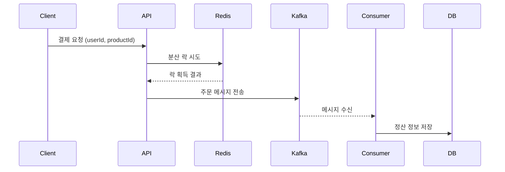

# FlashPay

## 📌 프로젝트 소개
FlashPay는 고트래픽 환경에서 안정적으로 결제와 정산을 처리할 수 있는 실시간 결제 처리 시스템입니다. Redis를 활용한 분산 락과 Kafka를 활용한 비동기 메시지 큐 구조를 통해 빠른 응답성과 데이터 일관성을 유지하는 것을 목표로 설계되었습니다.

---

## 🛠 기술 스택

| 영역       | 기술 및 도구                                     |
|------------|--------------------------------------------------|
| Language   | Java 17, Gradle                                  |
| Framework  | Spring Boot, Spring Security, Spring WebMVC      |
| 인증       | JWT (JSON Web Token), Spring Security             |
| 데이터베이스 | MySQL, Redis                                     |
| 메시징     | Apache Kafka                                      |
| 인프라     | Docker, Spring Cloud Config                       |
| 문서화     | Swagger (OpenAPI 3.0, springdoc-openapi)          |
| 테스트     | JMeter (성능 테스트), JUnit, Mockito              |

---

## 📁 폴더 구조

```bash
FlashPay/
├── src/
│   ├── main/
│   │   ├── java/com/flashpay/flashpay/
│   │   │   ├── config/        # 보안, Kafka, Redis 등 설정
│   │   │   ├── controller/    # REST API 컨트롤러
│   │   │   ├── domain/        # JPA 엔티티 클래스
│   │   │   ├── dto/           # 요청/응답 DTO
│   │   │   ├── service/       # 비즈니스 로직
│   │   │   ├── repository/    # JPA 인터페이스
│   │   │   ├── util/          # JwtUtil 등 유틸성 클래스
│   │   │   ├── common/        # ApiResponse 등 공통 객체
│   │   │   └── exception/     # 예외 처리 핸들러
│   └── resources/
│       ├── application.yml
│       └── static/
└── build.gradle
```

---

## 📄 ERD 설계

```plaintext
[User]
- id (PK)
- username (unique)
- email (unique)
- password
- createdAt

[Product]
- id (PK)
- title
- price
- stock
- startTime
- createdAt

[Order]
- id (PK)
- user_id (FK)
- product_id (FK)
- status (PENDING, SUCCESS, FAILED)
- createdAt

[Settlement]
- id (PK)
- order_id (FK)
- amount
- settledAt
```

---

## ✨ 주요 기능

### 사용자 인증
- JWT 기반 인증 처리
- 회원가입, 로그인 기능 구현
- 인증 필터를 통한 요청 검증

### 상품 등록 및 이벤트 관리
- 관리자 권한으로 상품 등록 가능
- 상품 리스트 조회 API 제공

### 주문 처리
- Redis 분산 락으로 중복 결제 방지
- Kafka를 통해 주문 요청을 비동기 전송
- 주문 요청 후 빠른 응답 및 후속 정산 처리

### 정산 처리
- Kafka Consumer가 주문 메시지 수신
- 사용자 및 상품 기준 정산 데이터 생성 및 저장
- 총 정산 금액, 최근 정산 내역 제공

---

## ⚙️ 시스템 아키텍처



---

## 📈 성능 테스트

- JMeter를 사용해 초당 500건의 주문 요청을 시뮬레이션
- 평균 성공 처리 수: 480~490건
- 성공률: 약 95% 이상

> Redis 락과 Kafka 비동기 처리 구조가 대량 트래픽 환경에서도 안정적으로 작동함을 확인했습니다.

---

## 🛠 개발 순서

1. ERD 설계 및 Entity 구성
2. JWT 인증 및 필터 적용
3. Redis 기반 분산 락 구현
4. Kafka 연동 및 Producer/Consumer 설정
5. 주문 및 정산 기능 구현
6. Swagger 기반 API 문서화
7. JMeter를 통한 부하 테스트
8. CI/CD 및 Docker 기반 실행 환경 구성

---

## 🧩 회고 및 배운 점

- Kafka를 처음 다뤄보며 비동기 메시지 흐름을 설계하고 운영하는 과정이 특히 인상 깊었습니다. 메시지 중복 처리, 순서 보장, 장애 발생 시의 복구 전략 등 여러 가지를 고려해야 한다는 점에서 복잡성과 중요성을 느낄 수 있었습니다.
- Redis를 활용한 분산 락 구현 시에는 락 획득 실패와 타임아웃 처리 등 안정적인 재처리 전략의 필요성을 체감했습니다.
- 테스트 코드와 성능 테스트 도구(JMeter)를 통해 기능뿐 아니라 실제 운영 환경에서도 견딜 수 있는 구조로 설계하고 점검하는 경험을 쌓을 수 있었습니다.
- 개발 과정 전체를 구조화하여 진행하면서 각 계층의 역할 분리와 서비스 확장성에 대한 설계 경험을 얻을 수 있었습니다.

> 앞으로는 운영 환경에서의 로깅 및 모니터링, 장애 대응 전략, 클라우드 환경에서의 배포 자동화 등을 추가로 학습하고 적용할 계획입니다.
